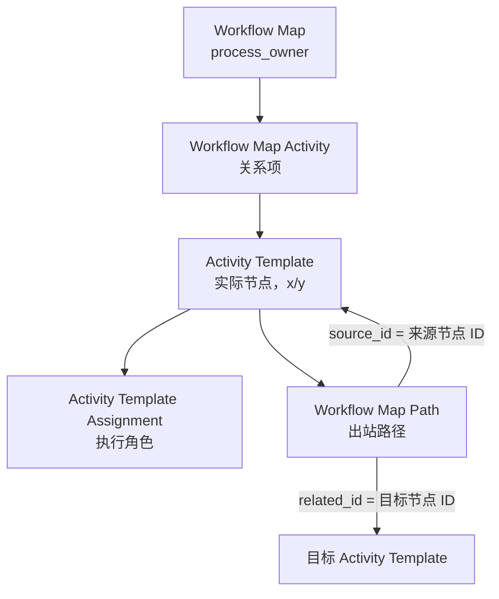

# 工作流程设定技术设计

## 1. 功能目标

- 功能名称：工作流程设定。
- 所属分类：系统配置。
- 一份 `.xlsx` 文件只解析一份 `Workflow Map`。
- 流程名称在页面中手工输入，不写入 Excel 模板。
- 先解析、校验并生成可编辑预览，用户确认后再调用一次 `Innovator.applyAML` 汇入。
- 支持新增和覆盖。覆盖时保留原 `Workflow Map` ID，删除旧 `Workflow Map Activity` 并重建节点与路径。

## 2. Aras 对象结构



AML 中的核心嵌套顺序为：

```text
Workflow Map
└─ Relationships
   └─ Workflow Map Activity
      └─ related_id / Activity Template
         └─ Relationships
            ├─ Activity Template Assignment
            └─ Workflow Map Path
```

`Workflow Map Path.source_id` 是来源 `Activity Template` ID，`related_id` 是目标 `Activity Template` ID。虽然论坛讨论中将 `Workflow Map Path` 描述为 null RelationshipType，该对象仍然用 `related_id` 保存目标节点。

## 3. 转折点的存放方式

### 3.1 字段含义

`Workflow Map Path` 上与线路排版相关的字段是：

| 字段 | 含义 | 示例 |
|---|---|---|
| `segments` | 路径上的转折点，是 Workflow Map 画布绝对坐标 | `390,75\|220,75` |
| `x` | 路径名称相对来源节点的 X 偏移 | `-85` |
| `y` | 路径名称相对来源节点的 Y 偏移 | `-105` |

`segments` 的原生序列化规则：

- 单个转折点：`x,y`，例如 `405,167`。
- 多个转折点：点之间使用 `|` 分隔，例如 `491,27|377,27`。
- 无转折点：空字符串，AML 为 `<segments />` 或 `<segments></segments>`。
- 实际线路依次连接：来源节点 → `segments` 各点 → 目标节点。

### 3.2 退回线示例

审核节点在 `(390,170)`，建立节点在 `(220,170)`时，上方退回线使用：

```xml
<Item type="Workflow Map Path" action="add" id="50000000000000000000000000000005">
  <authentication>none</authentication>
  <is_default>0</is_default>
  <is_override>0</is_override>
  <name>退回到建立者</name>
  <related_id>20000000000000000000000000000002</related_id>
  <segments>390,75|220,75</segments>
  <sort_order>256</sort_order>
  <source_id>20000000000000000000000000000003</source_id>
  <x>-85</x>
  <y>-105</y>
</Item>
```

这两个转折点使退回线从审核节点先向上走，再水平返回，最后向下连到建立节点，不会与正向主线重合。

### 3.3 实现规则

- 文件中已填写 `segments` 时，保留并按原生格式校验。
- 当目标节点的顺序不大于来源节点，且 `segments` 为空时，自动生成两个上方转折点。
- 同一张图上的多条退回线每条再向上偏移 48 画布单位，防止相互重合。
- 页面中可拖动节点和橙色转折点；双击路径新增转折点，右键转折点删除。
- 拖动后重新序列化 `segments`，并使已生成的 AML 失效，防止导入旧布局。

## 4. Excel 文件规范

### 流程节点

| 列 | 说明 |
|---|---|
| 顺序 | 节点显示和校验顺序 |
| 节点编码 | 文件内唯一稳定标识 |
| 节点名称 | `Activity Template.name`，必须唯一 |
| 节点类型 | 开始、普通、结束 |
| 执行角色 | Identity 名称或 32 位 ID |
| 是否自动 | 开始和结束节点导入时强制为自动 |
| X/Y 坐标 | `Activity Template.x/y` 画布绝对坐标 |
| 提示信息 | `Activity Template.message` |

### 流程路径

| 列 | 说明 |
|---|---|
| 来源/目标节点编码 | 引用“流程节点”中的编码 |
| 路径名称 | `Workflow Map Path.name` |
| 是否默认 | `is_default`，每个自动节点必须恰好一条 |
| 是否覆盖 | `is_override` |
| 认证方式 | `none` / `password` / `esignature` |
| 转折点 | `segments` 原生格式 |
| 名称偏移 X/Y | `Workflow Map Path.x/y`，留空时按折线中点自动计算 |

## 5. AML 组装与覆盖

### 新增

1. 查询同名 `Workflow Map`。
2. 新增模式下若同名项已存在，终止并提示更名或选择覆盖。
3. 为 Map、Map Activity、Activity Template、Assignment 和 Path 预生成 32 位大写 ID。
4. 以单个 `<AML>` 包含单个 `Workflow Map action="add"`，所有从属对象递归嵌套。

### 覆盖

1. 按名称查询唯一 `Workflow Map`；若存在多个同名项则拒绝自动覆盖。
2. 保留原 `Workflow Map.id`，根项使用 `action="edit"`。
3. 在同一个根项的 `<Relationships>` 内，先对旧 `Workflow Map Activity` 使用 `action="delete"`，再加入新节点。
4. 一次调用 `applyAML`，以保留对 Workflow Map ID 的外部引用（例如 Allowed Workflow）。

> 覆盖策略已按 AML 单次事务结构实现，但 dependent Item 删除行为、权限和 R37 定制事件仍需在目标环境使用备份模板验证。

## 6. Creator 处理

`process_owner` 不写入 Excel。当前代码中预留 `CreatorIdentityId` 常量：

- 用户提供 R37 环境 Creator Identity ID 后，填入该 32 位常量，AML 直接写 ID。
- 常量留空时，AML 使用嵌套 `Identity action="get"` 按名称查询 `Creator`，便于当前阶段跨环境验证。
- 工作流运行时，Creator 是 Aras 保留的动态 Identity；`process_owner` 同时是流程升级/管理的默认负责 Identity。

## 7. 校验规则

- 必须且只能有一个开始节点，至少有一个结束节点。
- 节点编码和名称在文件内唯一。
- 人工普通节点必须填写执行角色。
- 路径来源和目标必须存在，结束节点不得有出站路径。
- 自动非结束节点必须有出站路径，并且恰好一条默认路径。
- 检查节点入站路径和从开始节点的可达性，非致命问题以预览警告呈现。
- 所有 ID 均为 32 位十六进制字符串。

## 8. 官方资料与验证依据

- [Aras 官方文档：Aras Markup Language](https://www.aras.com/community/documentationlibrary/Innovator/25/Content/Innovator%2024%20Docs/Programmer%27s%20Guide/The%20Aras%20Markup%20Language%20AML.htm)：AML `Item` / `Relationships` 递归结构和配置项单次事务思路。
- [Aras 官方文档：Innovator Class](https://www.aras.com/community/documentationlibrary/Innovator/21/Content/Innovator%2022%20Docs/Programmer%27s%20Guide/Innovator%20Class.htm)：`applyAML` 调用。
- [Aras 官方论坛：Workflow Map and dependent relationship](https://community.aras.com/discussions/development/workflow-map-and-dependent-relationship/3832)：`Workflow Map Path.source_id` / `related_id` 的来源与目标方向，以及 Path 上的 `segments` / `x` / `y` 字段。
- [Aras 官方论坛：Execute multiple AML queries](https://community.aras.com/discussions/development/how-to-execute-multiple-aml-queries---innovator-admin/5314)：使用 `<AML>` 包含完整项并一次执行。
- [Aras 官方论坛：Workflow Process Path direction](https://community.aras.com/discussions/development/ad-workflow-process-path-to-started-workflow/7045/replies/7049)：运行时 Workflow Process Path 亦遵循 source/目标方向。
- [Aras 官方归档论坛：ECR Workflow Owner](https://www.aras.com/community/f/archive/1/support-q-amp-a---ecr-workflow-owner-question)：Creator/Owner/Manager 动态 Identity 和 Workflow Map process owner 语义。
- [ArasLabs workflow-utilities](https://github.com/ArasLabs/workflow-utilities) 和 [ArasLabs simple-doc-change-process](https://github.com/ArasLabs/simple-doc-change-process)：官方 ArasLabs 汇出包的 Workflow Map AML 实例。从实际汇出值 `405,167`、`491,27|377,27`、`491,121|745,121` 验证了 `segments` 格式；对照源节点坐标与 Path `x/y` 验证了名称相对偏移。

## 9. R37 环境验证清单

1. 提供 Creator Identity 固定 ID，替换 `CreatorIdentityId`。
2. 在测试库用“新增”导入完整 AML，确认节点、角色、路径和图标。
3. 在 Aras Workflow Map 编辑器中确认退回线的两个转折点保留，且名称位置正确。
4. 将同名文件改动后用“覆盖”导入，确认 Map ID 不变，旧 Activity Template/Path 无残留。
5. 在存在 Allowed Workflow 引用时执行覆盖，确认引用不受影响。
6. 制造一条无效 Identity 和一条无效 `segments`，确认在导入前拦截并记录中文错误。
